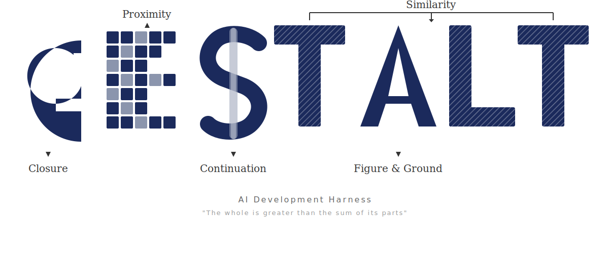

<p align="center">
  
</p>

<p align="center">
  <strong>Gestalt — AI Development Harness</strong><br/>
  Turn vague requirements into structured, executable plans — right inside Claude Code.
</p>

<p align="center">
  <a href="https://www.npmjs.com/package/@tienne/gestalt"></a>
  <a href="LICENSE"></a>
  <a href="https://github.com/tienne/gestalt/actions/workflows/ci.yml"></a>
</p>

<p align="center">
  <a href="./README.ko.md">한국어</a>
</p>

---

## What is Gestalt?

Gestalt is an MCP (Model Context Protocol) server that runs inside Claude Code. It conducts structured requirement interviews, generates a validated **Spec** (a JSON document capturing your goal, constraints, and acceptance criteria), and transforms that Spec into a dependency-aware execution plan — all without a separate API key.

> **Prerequisites:** Node.js >= 20.0.0. Use `nvm install 22 && nvm use 22` if needed.

---

## Quick Start

Install the plugin once, then use it in any Claude Code session:

```bash
# Step 1: Add to marketplace (one-time setup)
/plugin marketplace add tienne/gestalt

# Step 2: Install the plugin
/plugin install gestalt@gestalt
```

Then in any Claude Code session:

```bash
/interview "user authentication system"
/spec
/execute
```

No API key required — Gestalt runs as an MCP server inside Claude Code, and Claude Code handles all LLM reasoning.

→ **[Full MCP Reference](./docs/mcp-reference.md)** — all tools, parameters, and examples

---

## Why Gestalt?

Vague requirements are the primary source of implementation drift. When the goal isn't precise, Claude fills in gaps with assumptions — and those assumptions diverge from intent as the project grows.

Gestalt addresses this at the source. Before any code is written, it runs a structured interview guided by **Gestalt psychology principles** to reduce ambiguity to a measurable threshold (≤ 0.2). The result is a **Spec**: a validated JSON document that serves as the single source of truth for planning and execution.

### The Five Gestalt Principles

- **Closure** — Finds what's missing; fills in implicit requirements
- **Proximity** — Groups related features and tasks by domain
- **Similarity** — Identifies repeating patterns across requirements
- **Figure-Ground** — Separates MVP (figure) from nice-to-have (ground)
- **Continuity** — Validates dependency chains; detects contradictions

> "The whole is greater than the sum of its parts." — Aristotle

### How does Passthrough Mode work?

Gestalt runs as an **MCP server**. Claude Code acts as the LLM: Gestalt returns prompts and context, and Claude Code does the reasoning. The server makes no API calls.

```
You (in Claude Code)
       │
       ▼ /interview "topic"
  Gestalt MCP Server
  (returns context + prompts)
       │
       ▼
  Claude Code executes the prompts
  (generates questions, scores, plans)
       │
       ▼
  Gestalt MCP Server
  (validates, stores state, advances)
       │
       ▼ repeat until ambiguity ≤ 0.2
  Final Spec → Execution Plan
```

`ANTHROPIC_API_KEY` is not required. All LLM work is handled by Claude Code.

---

## Project Memory

Every spec and execution result is automatically recorded in `.gestalt/memory.json` at your repo root.

```json
{
  "specHistory": [
    { "specId": "...", "goal": "Build a user auth system", "sourceType": "text" }
  ],
  "executionHistory": [],
  "architectureDecisions": []
}
```

- **Commit it** — `.gestalt/memory.json` is plain JSON. Commit it and teammates inherit all prior decisions on `git pull`.
- **Context injection** — When generating the next spec, prior goals and architecture decisions are automatically injected into the prompt.
- **User profile** — Personal preferences are stored in `~/.gestalt/profile.json` and are never committed.

---

## Installation

### Option 1: Claude Code Plugin (Recommended)

Bundles the MCP server, slash-command skills, Gestalt agents, and project context — pre-configured in a single install.

```bash
# Step 1: Add to marketplace (one-time setup)
/plugin marketplace add tienne/gestalt

# Step 2: Install the plugin
/plugin install gestalt@gestalt
```

What you get out of the box:

| Item | Details |
|------|---------|
| **MCP Tools** | `ges_interview`, `ges_generate_spec`, `ges_execute`, `ges_create_agent`, `ges_agent`, `ges_status` |
| **Slash Commands** | `/interview`, `/spec`, `/execute`, `/agent` |
| **Agents** | 5 Gestalt pipeline agents + 9 Role agents + 3 Review agents |
| **CLAUDE.md** | Project context and MCP usage guide auto-injected |

> **Requires Node.js >= 20.0.0** — use [nvm](https://github.com/nvm-sh/nvm) if needed: `nvm install 22 && nvm use 22`

---

### Option 2: Claude Code Desktop

Open your Claude Code Desktop settings and add to `settings.json` (or `claude_desktop_config.json`):

```json
{
  "mcpServers": {
    "gestalt": {
      "command": "npx",
      "args": ["-y", "@tienne/gestalt"]
    }
  }
}
```

Restart Claude Code Desktop. The MCP tools become available immediately. Slash commands require the plugin or manual skills setup.

---

### Option 3: Claude Code CLI

```bash
# Via the claude CLI
claude mcp add gestalt -- npx -y @tienne/gestalt
```

Or edit `~/.claude/settings.json` directly:

```json
{
  "mcpServers": {
    "gestalt": {
      "command": "npx",
      "args": ["-y", "@tienne/gestalt"]
    }
  }
}
```

---

## Usage: Full Pipeline

### Step 1 — Interview

Start with any topic. A single rough sentence is enough.

```bash
/interview "I want to build a checkout flow with Stripe"
```

Gestalt conducts a multi-round interview. Each round targets a specific ambiguity dimension:

- **Closure** — What's missing? What did you assume but not say?
- **Proximity** — Which features belong together?
- **Similarity** — Are there repeating patterns across requirements?
- **Figure-Ground** — What's the core MVP vs. what's optional?
- **Continuity** — Any contradictions or conflicts?

The interview continues until the **ambiguity score reaches ≤ 0.2**:

```
Round 1 → ambiguity: 0.72  (lots of unknowns)
Round 4 → ambiguity: 0.45  (getting clearer)
Round 8 → ambiguity: 0.19  ✓ ready for Spec
```

#### Long interviews: Context Compression

When rounds exceed 5, Gestalt automatically signals that compression is available. Use the `compress` action to summarize earlier rounds and keep the context window lean:

```
1. respond returns needsCompression: true + compressionContext
2. ges_interview({ action: "compress", sessionId }) → compressionContext
3. Caller generates summary → submits it → stored in session
```

The compressed summary is automatically injected into all subsequent rounds.

---

### Step 2 — Spec Generation

**Option A — From text (no interview required):**

```bash
ges_generate_spec({ text: "Build a checkout flow with Stripe" })
```

**Option A-2 — With a built-in template:**

Three starter templates pre-fill common constraints and acceptance criteria:

| Template ID | Description |
|-------------|-------------|
| `rest-api` | REST API server with auth, CRUD, and OpenAPI |
| `react-dashboard` | React dashboard with charts, filters, and responsive layout |
| `cli-tool` | CLI tool with subcommands, config, and distribution |

```bash
ges_generate_spec({ text: "API with JWT authentication", template: "rest-api" })
```

**Option B — From a completed interview:**

```bash
/spec
```

Generates a structured **Spec** — a validated JSON document that drives the rest of the pipeline:

```
goal                → Clear, unambiguous project objective
constraints         → Technical and business constraints
acceptanceCriteria  → Measurable, verifiable success conditions
ontologySchema      → Entity-relationship model (entities + relations)
gestaltAnalysis     → Key findings per Gestalt principle
```

---

### Step 3 — Execute (Planning + Execution)

Transforms the Spec into a dependency-aware execution plan and runs it:

```bash
/execute
```

**Planning phase** applies 4 Gestalt principles in a fixed sequence:

| Step | Principle | What it does |
|:---:|-----------|-------------|
| 1 | **Figure-Ground** | Classifies acceptance criteria (ACs) as critical (figure) vs. supplementary (ground) |
| 2 | **Closure** | Decomposes ACs into atomic tasks, including implicit ones |
| 3 | **Proximity** | Groups related tasks by domain into logical task groups |
| 4 | **Continuity** | Validates the dependency DAG — no cycles, clear topological order |

**Execution phase** runs tasks in topological order. After each task, **drift detection** checks alignment with the Spec:

- 3-dimensional score: Goal (50%) + Constraint (30%) + Ontology (20%)
- Jaccard similarity-based measurement
- Auto-triggers a retrospective when drift exceeds threshold

#### Parallel execution groups

The `plan_complete` response includes `parallelGroups: string[][]`. Tasks with no mutual dependencies land in the same group and can be executed concurrently:

```json
"parallelGroups": [
  ["setup-db", "setup-env"],   // run in parallel
  ["create-schema"],           // after group above
  ["seed-data", "run-tests"]   // run in parallel
]
```

#### Resuming an interrupted execution

Pick up where you left off when a session is interrupted:

```bash
ges_execute({ action: "resume", sessionId: "<id>" })
```

Returns `ResumeContext`: completed task IDs, next task, and `progressPercent`. The `ges_status` response also includes `resumeContext` automatically for any executing session.

#### Brownfield audit

When a codebase already exists, audit it against the Spec before executing new tasks:

```bash
# Step 1: request audit context
ges_execute({ action: "audit", sessionId: "<id>" })
→ auditContext (systemPrompt, auditPrompt)

# Step 2: submit codebase snapshot + audit result
ges_execute({
  action: "audit",
  sessionId: "<id>",
  codebaseSnapshot: "...",
  auditResult: { implementedACs: [0,2], partialACs: [1], missingACs: [3], gapAnalysis: "..." }
})
```

#### Sub-agent spawning

Decompose a complex task into sub-tasks dynamically during execution:

```bash
ges_execute({
  action: "spawn",
  sessionId: "<id>",
  parentTaskId: "task-3",
  subTasks: [
    { title: "Write DB schema", description: "..." },
    { title: "Run migration", description: "...", dependsOn: ["spawned-<id>"] }
  ]
})
```

---

### Step 4 — Evaluate

Execution triggers a 2-stage evaluation:

| Stage | Method | On failure |
|:---:|-------|-----------|
| 1 | **Structural** — runs lint → build → test | Short-circuits; skips Stage 2 |
| 2 | **Contextual** — LLM validates each AC + goal alignment | Enters Evolution Loop |

**Success condition:** `score ≥ 0.85` AND `goalAlignment ≥ 0.80`

---

### Step 5 — Evolve

When evaluation fails, the Evolution Loop engages. Three recovery flows are available:

**Flow A — Structural Fix** (when lint/build/test fails)
```
evolve_fix → submit fix tasks → re-evaluate
```

**Flow B — Contextual Evolution** (when AC score is too low)
```
evolve → patch Spec (ACs/constraints) → re-execute impacted tasks → re-evaluate
```

Spec patch scope: ACs and constraints are freely editable; ontology can be extended; **goal is immutable**.

**Flow C — Lateral Thinking** (when stagnation is detected)

Gestalt rotates through lateral thinking personas rather than terminating:

| Stagnation Pattern | Persona | Strategy |
|--------------------|---------|---------|
| Hard cap hit | **Multistability** | See from a different angle |
| Oscillating scores | **Simplicity** | Strip down and converge |
| No progress (no drift) | **Reification** | Fill in what's missing |
| Diminishing returns | **Invariance** | Replicate what worked |

When all 4 personas are exhausted, the session terminates with **Human Escalation** — a structured list of actionable suggestions for manual resolution.

**Termination conditions:**

| Condition | Trigger |
|-----------|---------|
| `success` | score ≥ 0.85 AND goalAlignment ≥ 0.80 |
| `stagnation` | 2 consecutive rounds with delta < 0.05 |
| `oscillation` | 2 consecutive score reversals |
| `hard_cap` | 3 structural + 3 contextual failures |
| `caller` | Manual termination |
| `human_escalation` | All 4 lateral personas exhausted |

---

### Step 6 — Code Review

When evolution finishes, code review starts automatically:

```
review_start → agents submit perspectives → consensus → auto-fix
```

9 built-in **Role Agents** provide multi-perspective review:

| Agent | Domain |
|-------|--------|
| `architect` | System design, scalability |
| `frontend-developer` | UI, React, accessibility |
| `backend-developer` | API, database, server |
| `devops-engineer` | CI/CD, infrastructure, monitoring |
| `qa-engineer` | Testing, quality, automation |
| `designer` | UX/UI, design systems |
| `product-planner` | Roadmap, user stories, metrics |
| `researcher` | Analysis, data, benchmarks |
| `technical-writer` | Documentation, API docs, guides, README |

3 built-in **Review Agents** run focused code analysis:

| Agent | Focus |
|-------|-------|
| `security-reviewer` | Injection, XSS, auth vulnerabilities, secrets |
| `performance-reviewer` | Memory leaks, N+1 queries, bundle size, async |
| `quality-reviewer` | Readability, SOLID, error handling, DRY |

Use any agent outside the pipeline with `/agent`:

```bash
# List all available agents
/agent

# Run a specific agent on any task
/agent architect "review the module boundaries in this codebase"
/agent security-reviewer "check this authentication code for vulnerabilities"
/agent technical-writer "write a README for this module"
```

Generate custom Role Agents from interview results:

```
# Step 1: Get agent creation context
ges_create_agent  →  action: "start", sessionId: "<id>"
                  →  returns agentContext (systemPrompt, creationPrompt, schema)

# Step 2: Submit the generated AGENT.md content
ges_create_agent  →  action: "submit", sessionId: "<id>", agentContent: "..."
                  →  creates agents/{name}/AGENT.md
```

---

### CLI Mode (without Claude Code)

Want to run Gestalt without Claude Code? CLI mode runs interviews directly in your terminal. **Requires `ANTHROPIC_API_KEY`.**

```bash
# Start an interactive interview
npx @tienne/gestalt interview "my topic"

# Record the session as a GIF
npx @tienne/gestalt interview "my topic" --record

# Generate Spec from a completed session
npx @tienne/gestalt spec <session-id>

# List all sessions
npx @tienne/gestalt status

# Generate gestalt.json config
npx @tienne/gestalt setup

# Start the MCP server manually
npx @tienne/gestalt serve
```

#### Recording an interview session

Add `--record` (or `-r`) to capture the terminal session as a GIF:

```bash
npx @tienne/gestalt interview "my topic" --record
```

When the interview completes, a GIF is written to the current directory:

```
user-auth-interview-20260327.gif
```

The filename is generated by the LLM from the interview topic (kebab-case) plus a `YYYYMMDD` date stamp. No external binaries are required — recording uses `gifencoder` and `jimp` only.

**Resuming an interrupted session:** If a session is interrupted mid-recording, restarting the same session automatically detects the `.frames` file and continues where it left off. Temporary frame data is stored at `.gestalt/recordings/{sessionId}.frames` and deleted once the GIF is written.

---

## Configuration

Generate a `gestalt.json` with IDE autocompletion support:

```bash
npx @tienne/gestalt setup
```

```json
{
  "$schema": "./node_modules/@tienne/gestalt/schemas/gestalt.schema.json",
  "llm": {
    "model": "claude-sonnet-4-20250514"
  },
  "interview": {
    "ambiguityThreshold": 0.2,
    "maxRounds": 10
  },
  "execute": {
    "driftThreshold": 0.3,
    "successThreshold": 0.85,
    "goalAlignmentThreshold": 0.80
  }
}
```

**Config priority** (highest → lowest): code overrides → shell env vars → `.env` → `gestalt.json` → built-in defaults

Invalid values emit a warning and fall back to defaults.

### Environment Variables

| Variable | Config Path | Default | Description |
|----------|-------------|---------|-------------|
| `ANTHROPIC_API_KEY` | `llm.apiKey` | `""` | Required only for CLI direct mode |
| `GESTALT_MODEL` | `llm.model` | `claude-sonnet-4-20250514` | LLM model (provider-backed mode) |
| `GESTALT_AMBIGUITY_THRESHOLD` | `interview.ambiguityThreshold` | `0.2` | Interview completion threshold |
| `GESTALT_MAX_ROUNDS` | `interview.maxRounds` | `10` | Max interview rounds |
| `GESTALT_DRIFT_THRESHOLD` | `execute.driftThreshold` | `0.3` | Task drift detection threshold |
| `GESTALT_EVOLVE_SUCCESS_THRESHOLD` | `execute.successThreshold` | `0.85` | Evolution success score |
| `GESTALT_EVOLVE_GOAL_ALIGNMENT_THRESHOLD` | `execute.goalAlignmentThreshold` | `0.80` | Goal alignment threshold |
| `GESTALT_DB_PATH` | `dbPath` | `~/.gestalt/events.db` | SQLite event store path |
| `GESTALT_SKILLS_DIR` | `skillsDir` | `skills` | Custom skills directory |
| `GESTALT_AGENTS_DIR` | `agentsDir` | `agents` | Custom agents directory |
| `GESTALT_LOG_LEVEL` | `logLevel` | `info` | Log level (`debug`/`info`/`warn`/`error`) |

---

## Architecture


_(Diagram coming soon.)_

```
Claude Code (you)
     │
     ▼  MCP / stdio transport
┌──────────────────────────────────┐
│        Gestalt MCP Server        │
│                                  │
│  Interview Engine                │
│  ├─ GestaltPrincipleSelector     │
│  ├─ AmbiguityScorer              │
│  ├─ SessionManager               │
│  └─ ContextCompressor            │
│                                  │
│  Spec Generator                  │
│  ├─ PassthroughSpecGenerator     │
│  └─ SpecTemplateRegistry         │
│                                  │
│  Execute Engine                  │
│  ├─ DAG Validator                │
│  ├─ ParallelGroupsCalculator     │
│  ├─ DriftDetector                │
│  ├─ EvaluationEngine             │
│  ├─ AuditEngine                  │
│  └─ ExecuteSessionManager        │
│                                  │
│  Resilience Engine               │
│  ├─ StagnationDetector           │
│  ├─ LateralThinkingPersonas      │
│  └─ HumanEscalation              │
│                                  │
│  Agent System                    │
│  ├─ RoleAgentRegistry            │
│  ├─ RoleMatchEngine              │
│  └─ RoleConsensusEngine          │
│                                  │
│  EventStore (SQLite WAL)         │
└──────────────────────────────────┘
```

---

## License

MIT © [tienne](https://github.com/tienne)
